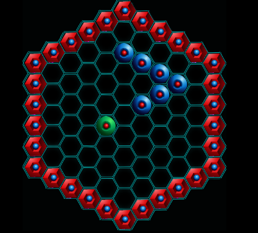

# Snake Game
Clone of a well known snake game. Decided to add a bit of a challenge by using a tilted Hexagonal grid instead.

### How to Play:
- Use arrow keys ← ↑ → ↓ to maneuvre the snake's head
- The valid moves are as follows: Up-Left, Up-Right, Down-Left, Down-Right
- 
- It cannot move directly up or down

### Rules:
- If the snake hits the wall  or itself  - the game resets
- Eating  will increase the length of the snake and the game speed

### Features:
- HTML5 Canvas, vanilla JavaScript
- FullScreen Resize - maintains proportional resize ratios independant of screen dimensions
- Provides limited support for touchscreen. Touch at the edges of the canvas to steer

### Graphics:
- All graphics belong to their appropriate copyright holders
- The material is presented for entirely non-profit educational demo purposes

### Demo
